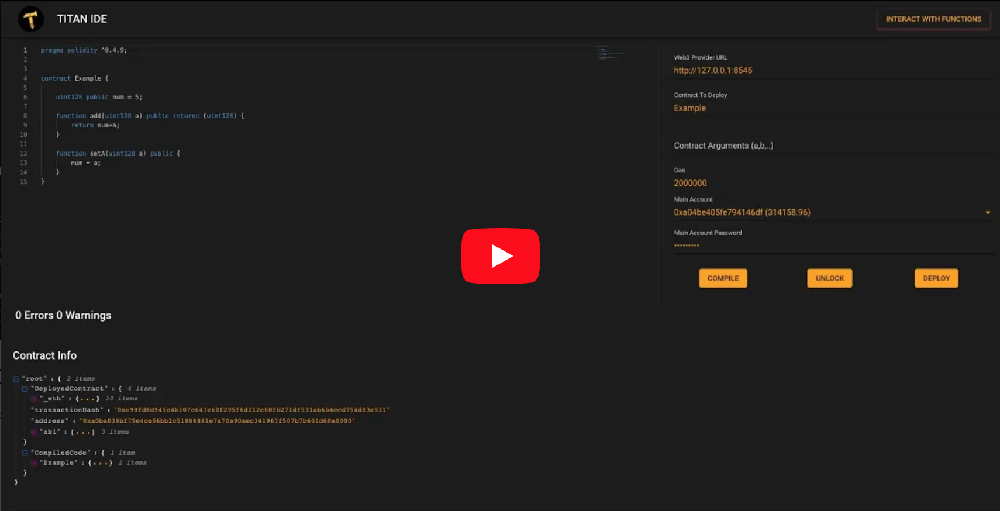
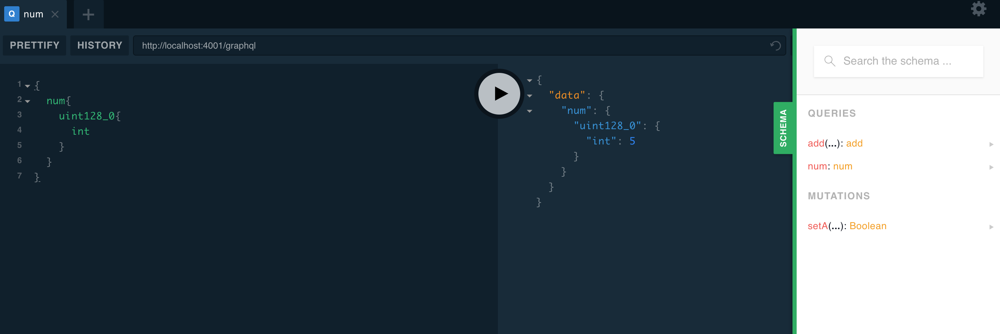
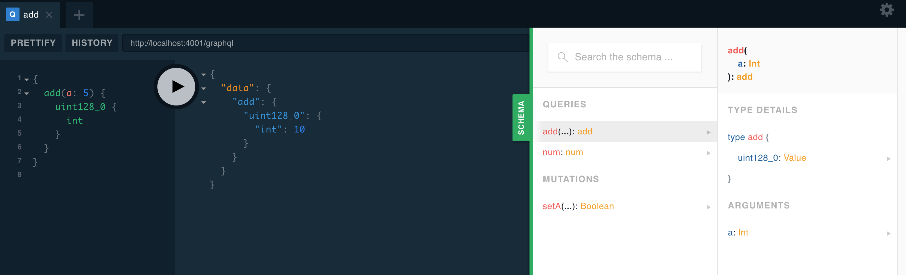
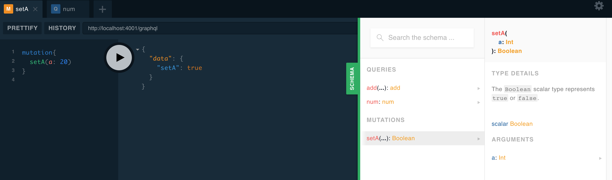
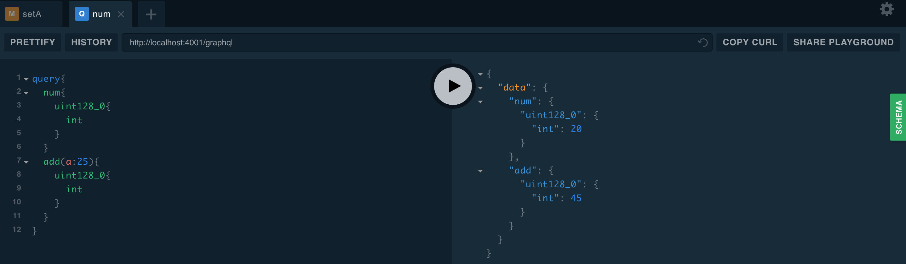

# Titan IDE

Titan IDE enables users to build **AION contracts with Solidity language**.

## To get get started

1. Download [IDE server](https://github.com/titan-suite/ide/releases).

2. Setup

   ```sh
    // with npm
    cd server && npm install && npm run start
    // with yarn
    cd server && yarn && yarn start
   ```

3. Visit [https://ide.titan-suite.com](https://ide.titan-suite.com).

### Video Guide

[](https://www.youtube.com/watch?v=dqfeFvpOUMA 'Titan IDE')

### Unlocking an account

#### Requirements: Web3 provider url, Account, Password

1. Start by inputting a web3 provider url.
2. Once a valid `AION` node is detected a dropdown will be populated with the list of accounts.
3. Input password linked to the chosen account.

### Deploying a contract

#### Requirements: Web3 provider url, Account, Password, Contract name

#### Optional: Gas, Contract arguments

1. Steps listed above
2. Name of the contract to deploy

##### Side note: The fallback value for Gas will be `1500000`

### Compiling a contract

#### Requirements: None

1. Once the contract is ready click the compile button.
2. A tree view will be populated with the contract information.

### Interacting with functions

Once the contract is deployed Titan playground will be available at [http://localhost:4001/graphql](http://localhost:4001/graphql).

Based on the `Example` Contract in the screenshot above here is how we can interact with the functions using GraphQL [Queries and Mutations](https://graphql.org/learn/queries/):

#### 1. Querying variable num

```javascript
{
  num {
    uint128_0{
      int
    }
  }
}
```



#### 2. Adding 5 to num

```javascript
{
  add(a: 5) {
    uint128_0 {
      int
    }
  }
}
```



#### 3. Setting num to 20

```javascript
mutation  {
  setA(a: 20)
}
```



#### 4. Combining Queries together

```javascript
query {
  num{
    uint128_0{
      int
    }
  }
  add(a:25){
    uint128_0{
      int
    }
  }
}
```


